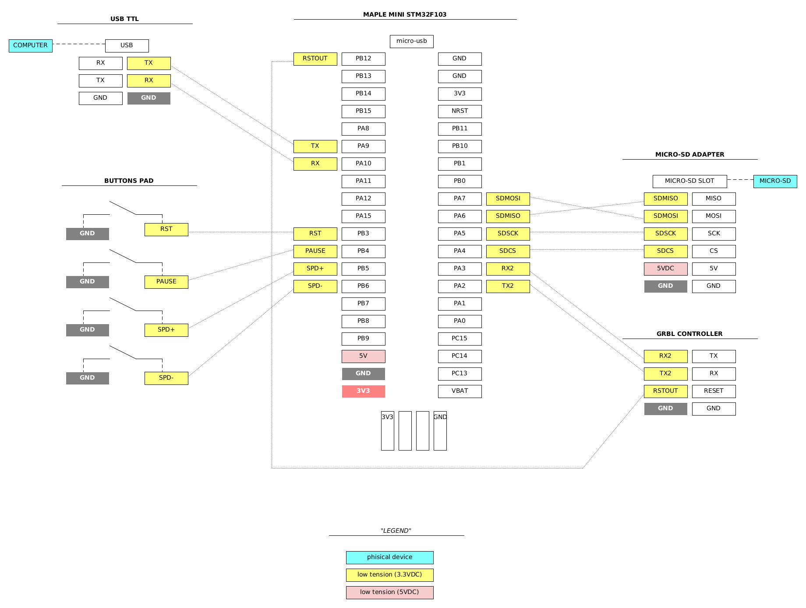
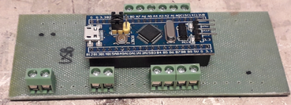
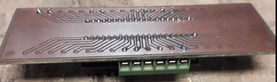

# iot-maple-mini-serial-grbl-fwd

<!-- TOC -->
- [iot-maple-mini-serial-grbl-fwd](#iot-maple-mini-serial-grbl-fwd)
  * [introduction](#introduction)
  * [description](#description)
  * [syntax](#syntax)
  * [usage demo](#usage-demo)
  * [custom homing / zero scripts](#custom-homing--zero-scripts)
  * [absolute and relative positioning respect to save/resume](#absolute-and-relative-positioning-respect-to-saveresume)
  * [pausing job](#pausing-job)
  * [resuming job](#resuming-job)
  * [develop stm32f103 breakout board](#develop-stm32f103-breakout-board)
  * [dev keynotes](#dev-keynotes)
  * [notes on vscode debugging](#notes-on-vscode-debugging)
<!-- TOCEND -->

## introduction

this forwarder is developed to allow stream and eventual preprocess some of gcode files to the marlin controller; the purpose of this project is to be used within a cnc machine and not with fdm printers for those marlin already provide everything needed.

## description

- forward gcode to [marlin](https://github.com/MarlinFirmware/Marlin) controller
- manage sdcard, list, send file
- manage grbl controller
    - reset
    - pause/unpause streaming sdcard file to grbl controller
    - change speed up/down (10%)
- save job and resume even if device turned off
- special commands starts with slash



## syntax

```
/ver           display version
/ls            list sdcard content
/home          do homing G28, go to safe zone and switch to G54 working
/zero          set zero 0,0,0 here
/send <file>   load sdcard file and send to gcode controller
/more <file>   view file content
/reset         reset gcode controller
/pause         pause/resume gcode controller print
/save          save paused printing job
/resume        resume saved printing job
/abort         cancel current sd print
/info          sys info
```

## usage demo

[](https://asciinema.org/a/371243)

## custom homing / zero scripts

Define custom `/home` and `/zero` script [here](https://github.com/devel0/iot-maple-mini-serial-grbl-fwd/blob/54ddec51e002adfd2c8ff6ac0a8e8eb678a1d120/iot-maple-mini-serial-grbl-fwd/config.h#L12)

:warning: set your own safe zone Z absolute height computed to homing process completed ( check your coord with M114 )

*home*
```gcode
G28
G90
G0Z200
```

*zero*
```gcode
G92X0Y0Z0
```

For delta robots its suggested to customize homing script in order to go in a safe zone where XY movements in the allowable radius doesn't make affectors exit their guidelines, for example:

```gcode
; homing
G28
; go to safe zone
G90
G0 Z200
```

## absolute and relative positioning respect to save/resume

when system start its default to absolute positioning G90, but during script G91 may used then each command sent to marlin controller keep tracked automatically to check current axis mode in order to restore the same situation if /resume command used after a /save and a power off.

## pausing job

a default queue of 4 cmds is used, this way planner can work having some prediction of subsequent commands but pause not take too much to receive ack of queued commands and stop the job.

## resuming job

the resume process can be called using `/resume` if a `/fwdstate.txt`, previously created by a `/save` command, exists. This file contains information about the filename and offset that was in execution when pause requested keeping track of the offset for the next command to execute if a print continue is requested.

this process executes follow actions in order:
- homing script
- ask user y/n to continue in the resume positioning ( first position XY then position Z )
- ask user y/n to continue in job execution

## tool change

[](https://asciinema.org/a/371446)

## develop stm32f103 breakout board

- [PCB pdf](data/doc/BREAKOUT_BOARD.pdf)

- [EASYEDA project](https://easyeda.com/lorenzo.delana/mini-maple-stm32f103-breakout)





## dev keynotes

- [state machine][1]
- uart [baud rate][2] set to 1Mbit/s
- [Serial2][3] ( marlin connection ) take precedence over all other activities because stm32 uart doesn't have hardware FIFO buffer that can cause char lost for example if you log to the Serial1 during rx
- to avoid Serial1 ( console connection ) to write too much a special [deferred serial][4] circular buffer allow you to stream print then the loop will flush 1 char at loop after rx from serial2 [expired][5]
- non console commands ( those that not starts with slash ) will forwarded to marlin and a special variable [marlin_cmds_avail][6] keeps track of how much commands queued in order to not exceed but maintain max pressure to allow planner predict some optimization in the speed junction; during rx buffer evaluation process `ok Pxx Byy` ( marlin ADVANCED_OK required ) this variable will incremented. during tx to marlin [Serial2_println][7] helper function this variable will decremented.
- [SYNCED][8] macro is a convenient way to know if state is normal and all buffer flushed to execute some synced operation ([example][9]

[1]: https://github.com/devel0/iot-maple-mini-serial-grbl-fwd/blob/2d3c3685ebb0bd44b68d19011f69fd90f436ce8b/iot-maple-mini-serial-grbl-fwd/Global.h#L8
[2]: https://github.com/devel0/iot-maple-mini-serial-grbl-fwd/blob/86057ea6bf172b2c50c7304eafc9808bc15a5c2c/iot-maple-mini-serial-grbl-fwd/config.h#L9
[3]: https://github.com/devel0/iot-maple-mini-serial-grbl-fwd/blob/9815d26e4cd1a46d19c26becdee08b766f6351fe/iot-maple-mini-serial-grbl-fwd/Global.cpp#L139
[4]: https://github.com/devel0/iot-maple-mini-serial-grbl-fwd/blob/9815d26e4cd1a46d19c26becdee08b766f6351fe/iot-maple-mini-serial-grbl-fwd/Global.cpp#L53
[5]: https://github.com/devel0/iot-maple-mini-serial-grbl-fwd/blob/86057ea6bf172b2c50c7304eafc9808bc15a5c2c/iot-maple-mini-serial-grbl-fwd/config.h#L14
[6]: https://github.com/devel0/iot-maple-mini-serial-grbl-fwd/blob/9815d26e4cd1a46d19c26becdee08b766f6351fe/iot-maple-mini-serial-grbl-fwd/Global.cpp#L33
[7]: https://github.com/devel0/iot-maple-mini-serial-grbl-fwd/blob/9815d26e4cd1a46d19c26becdee08b766f6351fe/iot-maple-mini-serial-grbl-fwd/Global.cpp#L105
[8]: https://github.com/devel0/iot-maple-mini-serial-grbl-fwd/blob/9815d26e4cd1a46d19c26becdee08b766f6351fe/iot-maple-mini-serial-grbl-fwd/Global.cpp#L131
[9]: https://github.com/devel0/iot-maple-mini-serial-grbl-fwd/blob/9815d26e4cd1a46d19c26becdee08b766f6351fe/iot-maple-mini-serial-grbl-fwd/Global.cpp#L816

## notes on vscode debugging

- prerequisites
    - https://github.com/stm32duino/Arduino_Core_STM32
    - https://www.st.com/en/development-tools/stm32cubeprog.html
    - https://github.com/xpack-dev-tools/arm-none-eabi-gcc-xpack/releases
- update `.vscode` json files paths accordingly to your tools path
- connect STLINK V2 ( 4 wires 3.3-swdio-swclk-gnd )
